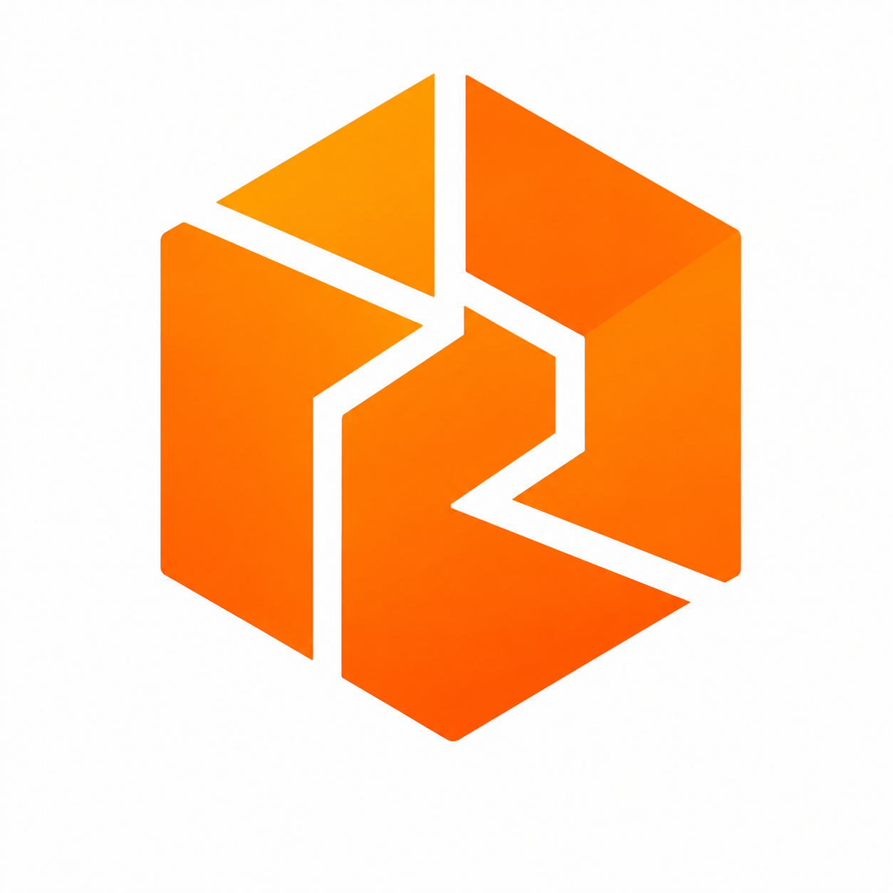
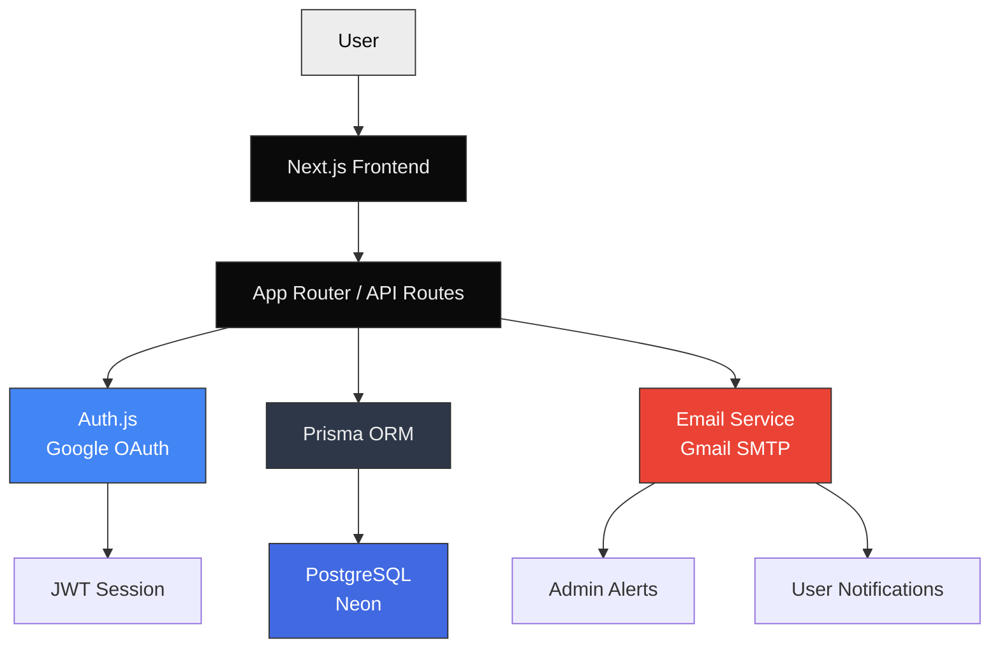

<div align="center">

<!-- Logo placeholder -->


# Hive

**Join the Hive. Build Together.**

*Where college students find teammates, build projects, and ship products that matter.*

---

[](https://nextjs.org)
[](https://typescriptlang.org)
[](https://tailwindcss.com)
[](https://prisma.io)
[](https://neon.tech)
[](#license)
[](#contributing)

</div>

---

## Table of Contents

- [Why Hive Exists](#why-hive-exists)
- [Features](#features)
- [Screenshots](#screenshots)
- [Tech Stack](#tech-stack)
- [Architecture](#architecture)
- [Getting Started](#getting-started)
- [Environment Variables](#environment-variables)
- [Folder Structure](#folder-structure)
- [Performance](#performance)
- [Contributing](#contributing)
- [Roadmap](#roadmap)
- [Support](#support)
- [License](#license)

---

## Why Hive Exists

Finding the right teammates in college shouldn't be this hard.

You have an idea. You need a designer, a backend developer, maybe someone who understands ML. You post in a WhatsApp group. Nothing happens. You ask around campus. Nobody's available. The semester ends. The idea dies.

This happens to millions of students, every semester, at every college in the world.

Hive exists to fix that. Not with another social network. Not with a job board. With a focused platform where students post what they're building, describe who they need, and find the exact people who complement their skills.

One profile. One project post. One collaboration.

That's the entire idea.

---

## Features

### Discovery & Matching

- **Project Explorer** — Browse open projects filtered by department, skills, status, and recency
- **Smart Matching** — Skill-based recommendations surface the right teammates automatically
- **Student Profiles** — Department, year, skills, bio, GitHub, LinkedIn — everything you need to evaluate a collaborator

### Collaboration

- **Project Listings** — Post projects with descriptions, required skills, and team size
- **Applications** — Apply to projects with one click. Owners accept or decline.
- **Invitations** — Send direct invitations to specific students
- **Real-time Notifications** — In-app inbox for applications, invitations, and updates

### Community

- **Events & Hackathons** — Admin-curated events surfaced on your dashboard
- **Bookmarks** — Save interesting projects for later
- **Communities** — Discover and join interest-based groups

### Authentication & Security

- **Google OAuth** — Institutional `.edu` / `.ac.in` email verification
- **Student ID Verification** — Manual admin review for students without institutional email
- **JWT Sessions** — Stateless, secure session management
- **Role-based Access** — Admin panel with full user and content management

### Platform

- **Dark Mode** — System-aware with manual toggle
- **Responsive Design** — Optimized from 320px to 4K
- **Cinematic UI** — GSAP-powered scroll animations with Lenis smooth scrolling
- **Admin Console** — User management, ID verification, abuse logs, allowed emails
- **Email Notifications** — Gmail SMTP integration for verification results and admin alerts

---

## Screenshots

<!-- Replace with actual screenshots -->

| | |
|:---:|:---:|
| **Landing Page** | **Dashboard** |
|  |  |
| **Project Explorer** | **Project Detail** |
|  |  |
| **Profile** | **Mobile** |
|  |  |

---

## Tech Stack

| Layer | Technology | Purpose |
|-------|-----------|---------|
| **Frontend** | Next.js 16 (App Router) | Server-rendered React with streaming |
| **Language** | TypeScript 5.x | Type-safe development |
| **Styling** | Tailwind CSS 4.x | Utility-first styling |
| **Animations** | GSAP 3.15, Lenis 1.3 | Scroll-triggered cinematic animations |
| **Database** | PostgreSQL (Neon) | Serverless Postgres hosting |
| **ORM** | Prisma 6.x | Type-safe database access |
| **Authentication** | Auth.js v5 (NextAuth) | Google OAuth + session management |
| **Email** | Gmail SMTP (Nodemailer) | Transactional email delivery |
| **Deployment** | Vercel | Edge-optimized hosting |
| **Icons** | Lucide React | Consistent icon system |
| **UI Components** | Radix UI, shadcn/ui | Accessible primitives |

---

## Architecture



---

## Getting Started

### Prerequisites

- Node.js 18+
- npm or pnpm
- A [Neon](https://neon.tech) PostgreSQL database
- A [Google Cloud Console](https://console.cloud.google.com) OAuth credentials

### Installation

```bash
# Clone the repository
git clone https://github.com/ShravanDeb/Hive.git
cd Hive

# Install dependencies
npm install

# Set up environment variables
cp .env.example .env
# Edit .env with your credentials

# Generate Prisma client
npx prisma generate

# Push database schema
npx prisma db push

# Seed skills
npx tsx prisma/seed.ts

# Start development server
npm run dev
```

Open [http://localhost:3000](http://localhost:3000).

### Available Scripts

| Command | Description |
|---------|-------------|
| `npm run dev` | Start development server |
| `npm run build` | Production build |
| `npm run start` | Start production server |
| `npm run lint` | Run ESLint |
| `npx prisma studio` | Open database GUI |
| `npx prisma db push` | Sync schema to database |

---

## Environment Variables

Copy `.env.example` to `.env` and configure:

| Variable | Required | Description |
|----------|----------|-------------|
| `DATABASE_URL` | Yes | PostgreSQL connection string (Neon) |
| `AUTH_SECRET` | Yes | Random secret for JWT signing |
| `AUTH_GOOGLE_ID` | Yes | Google OAuth Client ID |
| `AUTH_GOOGLE_SECRET` | Yes | Google OAuth Client Secret |
| `NEXTAUTH_URL` | Yes | App base URL (`http://localhost:3000` or production URL) |
| `GMAIL_USER` | Yes | Gmail address for SMTP |
| `GMAIL_PASS` | Yes | Gmail App Password (not regular password) |
| `EMAIL_FROM` | Yes | Sender display email |

> **Important:** Never commit `.env` to version control. It is excluded via `.gitignore`.

---

## Folder Structure

```
hive/
├── prisma/
│   ├── schema.prisma        # Database schema
│   └── seed.ts              # Seed script
├── public/                   # Static assets
├── src/
│   ├── app/
│   │   ├── (auth)/           # Auth pages (login, signup, onboarding)
│   │   ├── admin/            # Admin console
│   │   ├── api/              # API routes
│   │   ├── dashboard/        # Dashboard
│   │   ├── projects/         # Project explorer & detail
│   │   ├── profile/          # User profiles
│   │   └── new-landing/      # Landing page
│   ├── components/
│   │   ├── animated/         # GSAP animation components
│   │   ├── moderation/       # Content moderation
│   │   └── ui/               # Reusable UI primitives
│   ├── hooks/                # Custom React hooks
│   ├── lib/                  # Utilities, auth, email, prisma
│   ├── styles/               # Global CSS
│   └── types/                # TypeScript definitions
├── .env.example              # Environment template
├── next.config.ts            # Next.js configuration
├── tailwind.config.ts        # Tailwind configuration
└── package.json
```

---

## Performance

| Metric | Approach |
|--------|----------|
| **Server Rendering** | Next.js App Router with RSC for zero-client JS where possible |
| **Code Splitting** | Automatic route-based splitting via App Router |
| **Lazy Loading** | Dynamic imports for heavy components (GSAP, animations) |
| **Caching** | Next.js fetch cache + Prisma query optimization |
| **Images** | WebP/AVIF format with Next.js Image component |
| **Bundle** | Tree-shaking, unused code elimination in production |
| **Database** | Serverless Postgres (Neon) with connection pooling |
| **SEO** | Server-rendered HTML, OpenGraph tags, semantic markup |

---

## Contributing

We welcome contributions from the community. Please read our [Contributing Guidelines](CONTRIBUTING.md) before submitting a pull request.

```bash
# Fork the repository
# Create a feature branch
git checkout -b feat/your-feature

# Make your changes
# Commit with a descriptive message
git commit -m "feat: add your feature"

# Push and create a PR
git push origin feat/your-feature
```

---

## Roadmap

### Current

- [x] Google OAuth authentication
- [x] Student ID verification flow
- [x] Project creation and management
- [x] Application and invitation system
- [x] Admin console with user management
- [x] Real-time notification inbox
- [x] Cinematic landing page with GSAP
- [x] Dark mode with system preference
- [x] Responsive design (mobile + desktop)
- [x] Neon PostgreSQL database

### Upcoming

- [ ] Direct messaging between students
- [ ] AI-powered project recommendations
- [ ] Skill assessment and verification
- [ ] Team formation algorithms
- [ ] Calendar integration for events
- [ ] Email digest notifications
- [ ] Public profiles and portfolio pages

### Long-Term

- [ ] Mobile apps (iOS + Android)
- [ ] API for third-party integrations
- [ ] Analytics dashboard for project leads
- [ ] AI project scoping assistant
- [ ] University partnership portal
- [ ] Global hackathon network

See the full [Roadmap](ROADMAP.md) for details.

---

## License

Hive is proprietary software. See [LICENSE](LICENSE) for details.

Copyright © 2026 Shravan Deb. All Rights Reserved.

---

<div align="center">

Built with care for student innovators everywhere.

</div>
